# 🏃 AI health — тренировки, еда, здоровье и AI-ассистент в одном приложении для iPhone

Личный ассистент, который считает калории по фотографии, забирает метрики с часов и отвечает на вопросы по своим данным: «Cколько км я вчера пробежал?», «Проанализируй мой сон за неделю», «Как менялся вес за месяц».

Обычные трекеры калорий забрасывают на третий день — слишком много ручного ввода. Здесь ввод сведён к фото и голосу, а анализ делает LLM-агент.

## ✨ Что умеет

- 📷 **Еда за пять секунд** — фото, голосовое или текст «съел 200 г гречки». Vision разбирает состав, справочник считает калории, ты только подтверждаешь.
- 🧠 **Персональный сканер** — продукт, который уже встречался, подставляется с твоим названием и привычной порцией.
- 💬 **Спроси о себе** — «Сколько прошёл вчера км?». Агент сам поднимет твои записи и покажет таблицей.
- 📖 **Научная база** — гибридный поиск по статьям PubMed и ВОЗ в векторной базе.
- ⌚ **Метрики с часов** — шаги, сон, пульс, вес приезжают из Apple Health или Google Health.
- 🏥 **Анализы крови** — скан бланка, 27 показателей за раз, отклонения подсвечены.
- 🌅 **Дайджесты** — утренняя сводка, вечерний итог, недельный разбор, алерты по весу и стрессу.

## 🛠 Стек

- **LangGraph** — два графа: один понимает, о чём ты написал, второй записывает еду
- **PostgreSQL 16** — 17 таблиц, витрины дня для агента
- **Qdrant** — поиск сразу двумя способами: по смыслу (bge-m3) и по словам (BM25), результаты сводятся вместе и переупорядочиваются реранкером
- **Langfuse** — трейсинг вызовов, стоимость, 38 промптов правятся из интерфейса
- **Prometheus + Grafana** — продуктовые метрики
- **Python 3.12, aiogram 3, FastAPI**
- **Docker Compose**

Провайдер моделей меняется одной переменной: текст, vision и распознавание речи настраиваются отдельно.

## 🔀 Графы LangGraph

Два формальных графа, оба видны в LangGraph Studio.

`router_graph` решает, запись это еды или вопрос. `meal_graph` записывает еду — и в нём есть настоящий interrupt: если вес не назвали, граф останавливается на `clarify` и переспрашивает, а не угадывает.

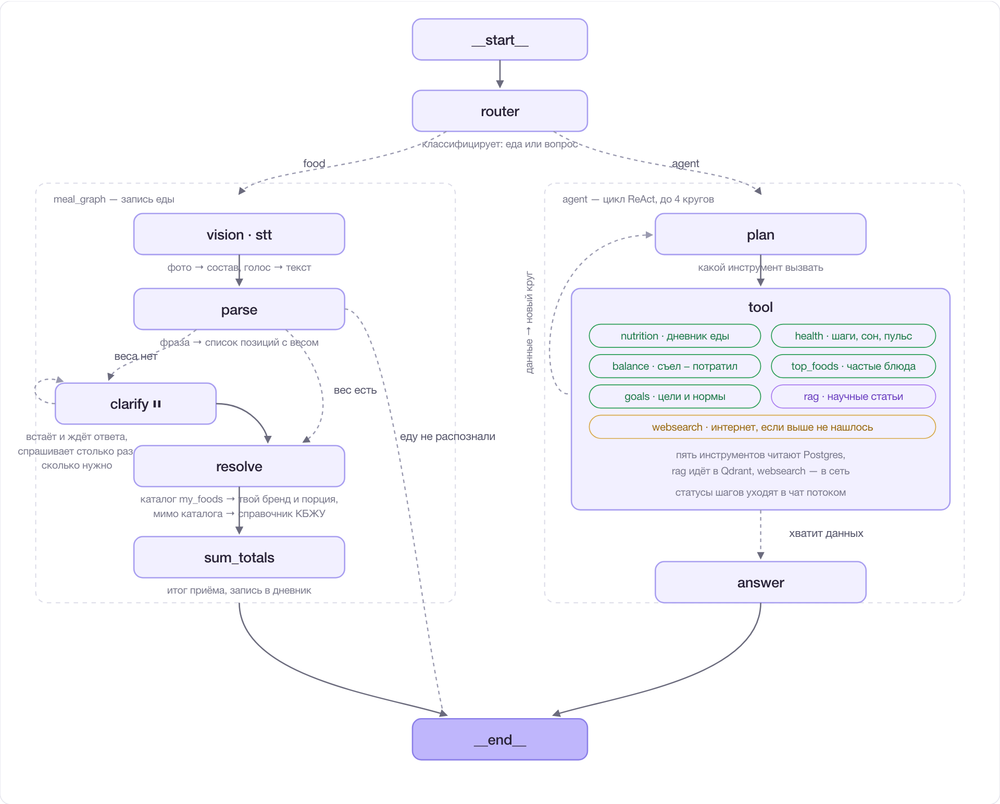

### 🧰 Агент и его инструменты

Семь инструментов, SQL написан заранее — модель выбирает только имя инструмента и период:

| Инструмент | Что делает |
|---|---|
| `nutrition` | питание по дням: калории, БЖУ |
| `health` | шаги, сон, пульс, вес из часов |
| `balance` | съел минус потратил |
| `top_foods` | частые продукты за период |
| `goals` | цели и нормы |
| `rag` | научные статьи в Qdrant |
| `websearch` | интернет, если выше не нашлось |

Цикл «план → инструмент» крутится до четырёх кругов, затем агент собирает ответ. Модель не пишет SQL и не может ничего изменить: все инструменты только читают, `user_id` подставляет код.

## 🗺 Архитектура целиком

Где эти графы живут: откуда приходят сообщения, куда ложатся данные, что за чем следит.

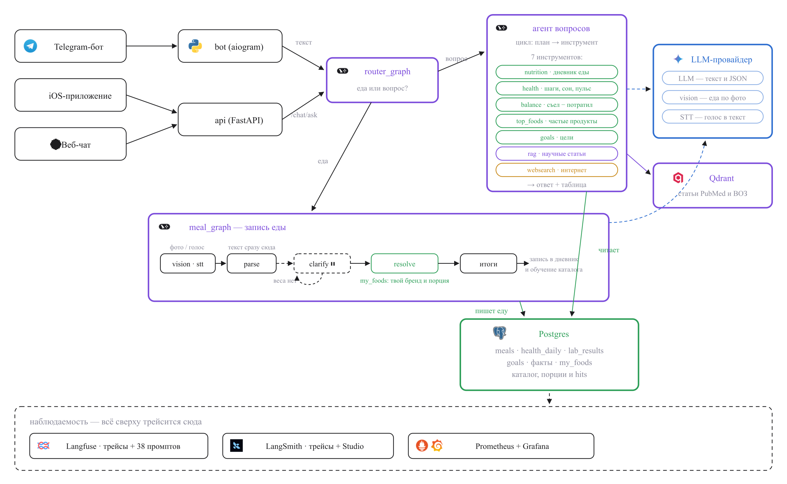

## 📱 Как это выглядит

### 📲 Приложение

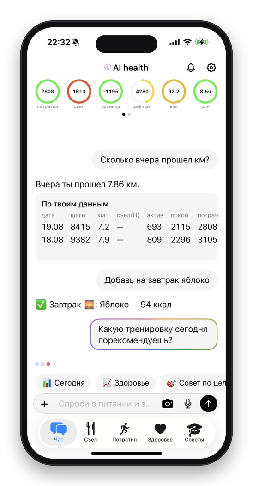 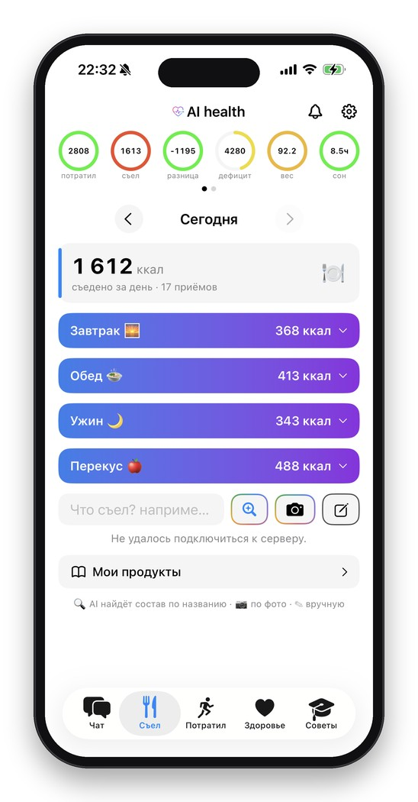 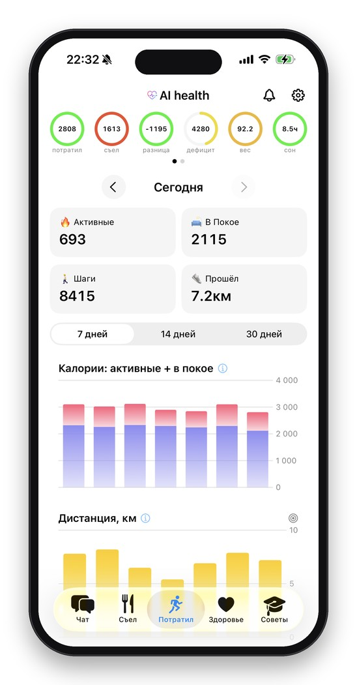 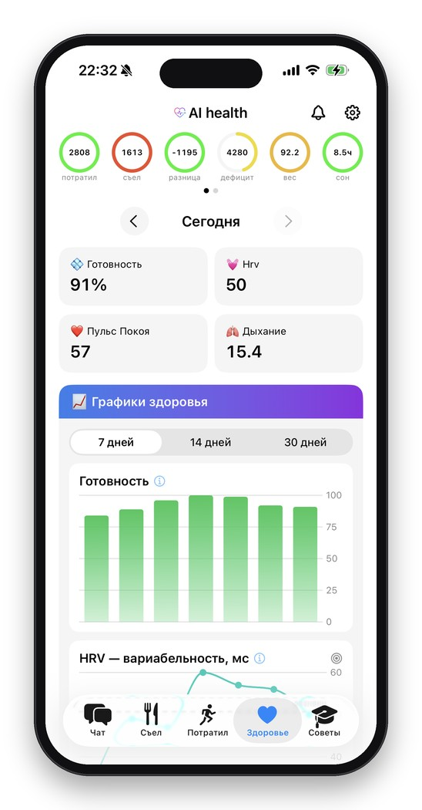 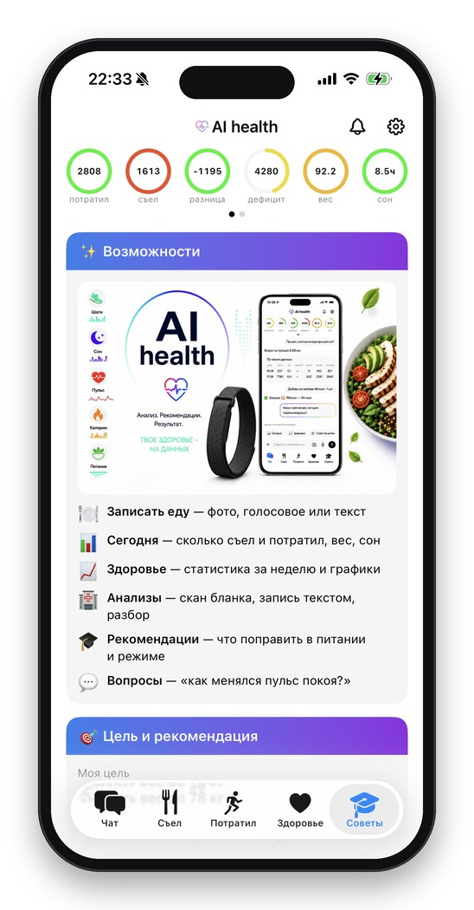

**Чат** — вопрос по своим данным · **Еда** — приёмы за день · **Активность** — графики за период · **Здоровье** — готовность, HRV, сон · **Советы** — возможности и цель

### 💬 Telegram

Тот же агент без установки — обложка, разбор еды и меню разделов:

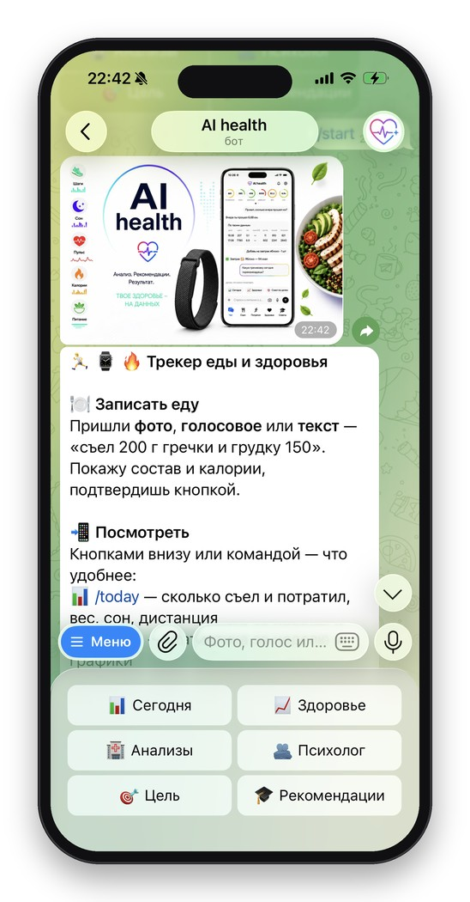

### 🌐 Веб-версия

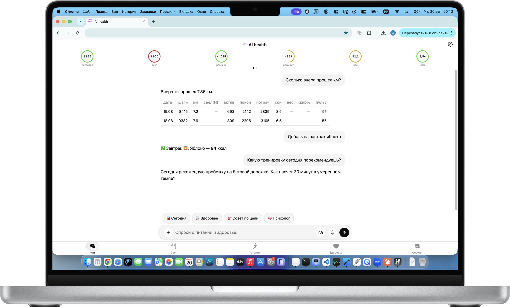

## 🔍 Наблюдаемость

**Langfuse**

Каждый запрос - трейс с деревом вызовов и стоимостью:

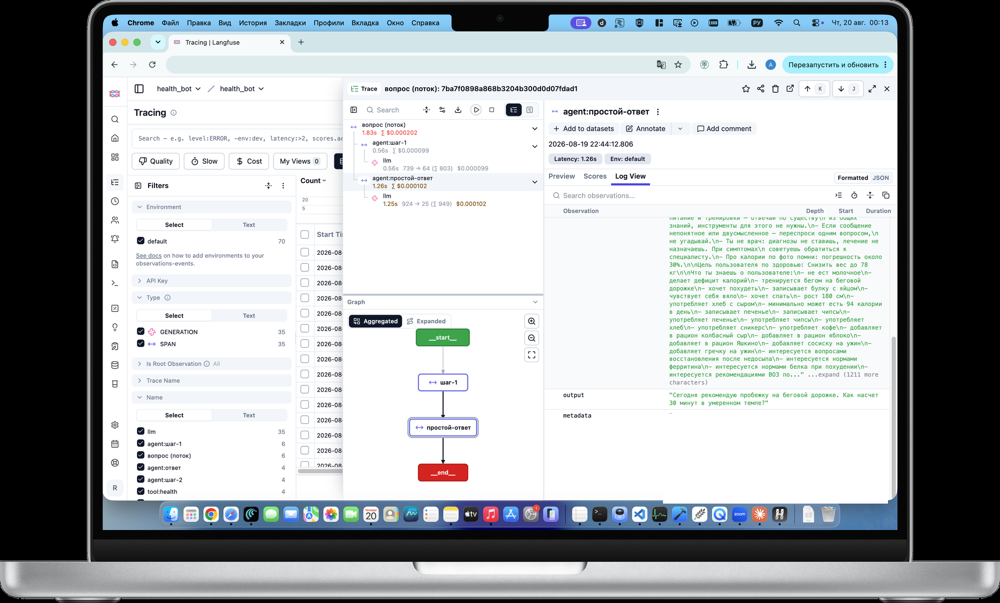

**Grafana**

Что происходит с проектом в цифрах: сколько обращений и записей о еде за сутки, сколько раз позвали модели, доехали ли данные с часов, сделался ли бэкап.

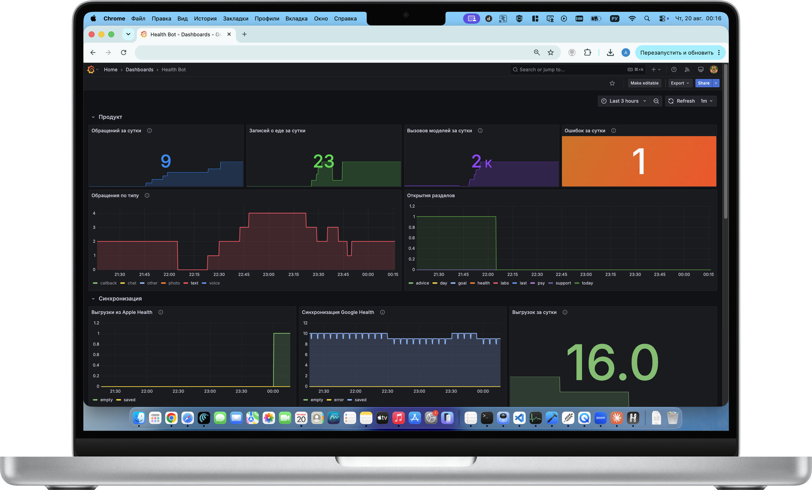


**Qdrant**

Векторная база знаний(RAG):


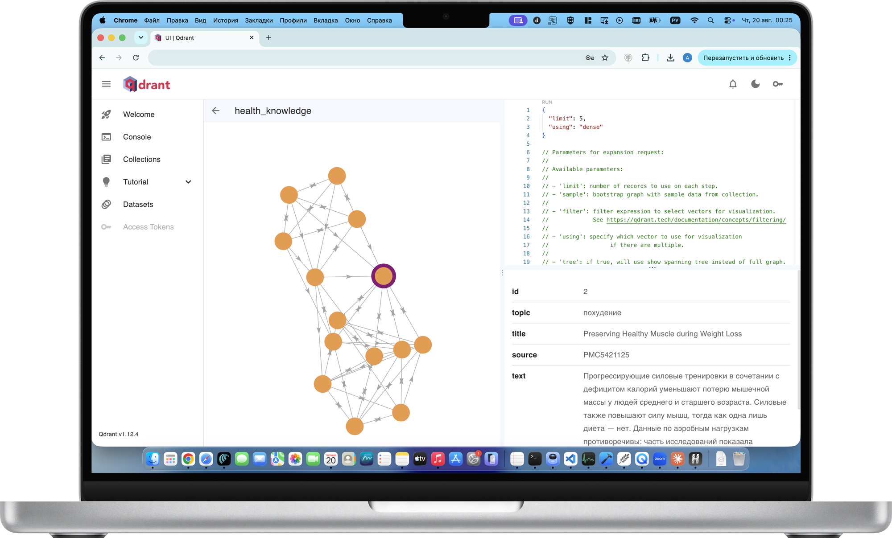

## 🎬 Видео

[Как работает приложение](docs/demo/AI_health.mp4) — 92 секунды.

Подробная презентация архитектуры: [docs/demo/presentation.html](docs/demo/presentation.html) — открой в браузере.

## 🔄 Сценарий

1. Пишешь боту фото тарелки, голосовое или текст.
2. Роутер решает: это запись еды или вопрос.
3. Для еды — vision или разбор фразы, дальше поиск в личном каталоге.
4. Не назвал вес — граф останавливается и переспрашивает.
5. Известный продукт подставляется с твоей привычной порцией, новый — уходит в справочник КБЖУ.
6. Подтверждаешь кнопкой, запись уходит в дневник и обучает каталог.
7. Для вопроса — агент выбирает инструменты и собирает ответ таблицей.
8. Метрики с часов приезжают отдельно и ложатся в ту же витрину дня.
9. Утром и вечером приходят сводки, раз в неделю — разбор динамики.

## 📦 Что не вошло в репозиторий

iOS-приложение и веб-интерфейс вырезаны — они завязаны на личный сервер. Осталась серверная часть: бот, агент, графы, API для выгрузки данных с часов, миграции и мониторинг.

## 🚀 Установка

```bash
git clone <repo> && cd ai-health
cp .env.example .env      # заполнить BOT_TOKEN, POSTGRES_PASSWORD, ключ модели
docker compose up -d --build
```

Миграции накатываются сами при старте.

Мониторинг и трейсинг поднимаются отдельными файлами:

```bash
docker compose -f docker-compose.monitoring.yml up -d   # Prometheus + Grafana
docker compose -f docker-compose.langfuse.yml up -d     # Langfuse
```

## ✅ Тесты

```bash
pytest -q
```

72 теста: разбор фразы в позиции еды, резолв продуктов через каталог, валидация полезной нагрузки API, работа графов.

## 📂 Устройство кода

```
app/
  bot.py            точка входа Telegram-бота
  api.py            FastAPI: выгрузка с часов, метрики, авторизация
  config.py         настройки из окружения
  graph/            LangGraph: router_graph, meal_graph, ReAct-агент
  handlers/         команды бота, еда, анализы, психолог
  services/         резолв продуктов, база знаний, веб-поиск, оценка качества
  providers/        обёртки над LLM: RouterAI, Yandex
  db/               пул, репозиторий, миграции
  prompts.py        38 промптов, дублируются в Langfuse
migrations/         25 SQL-миграций
monitoring/         конфиг Prometheus и дашборд Grafana
```

## ⚖️ Контроль качества

Раз в две недели LLM-судья прогоняет эталонные вопросы и ставит оценки за достоверность, релевантность и связность. Точность чисел проверяется кодом, без модели — сверкой с витриной дня. Результаты уходят в Langfuse.

## 🔒 Приватность

Свой сервер, своя база, ежедневные бэкапы. Третьих сторон нет, кроме провайдера моделей. Доступ к боту — по списку разрешённых Telegram ID.
